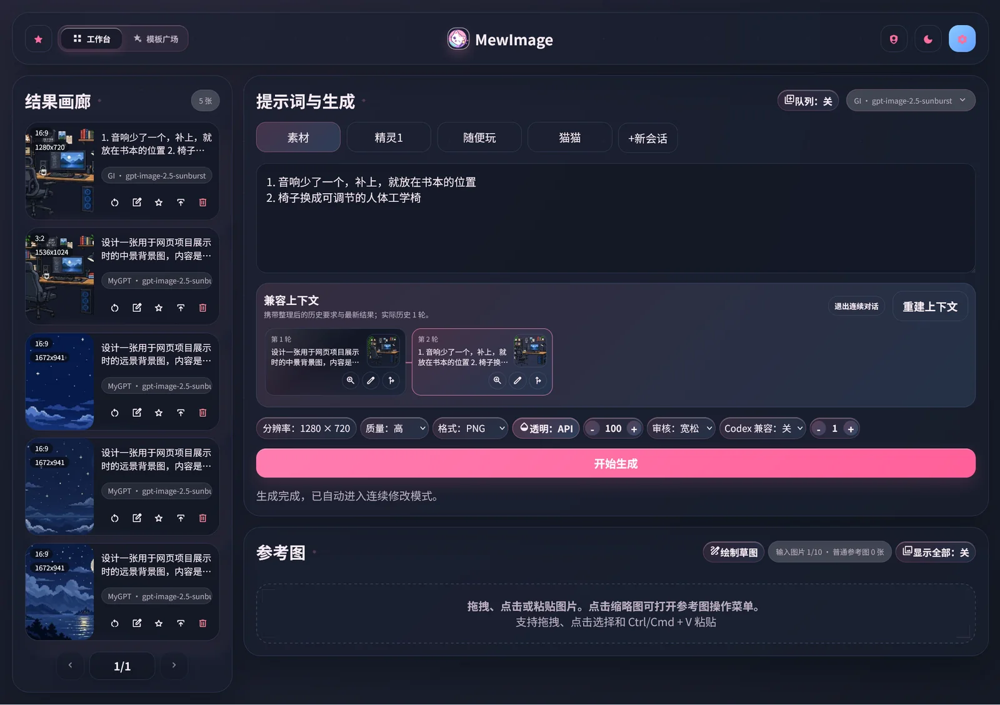
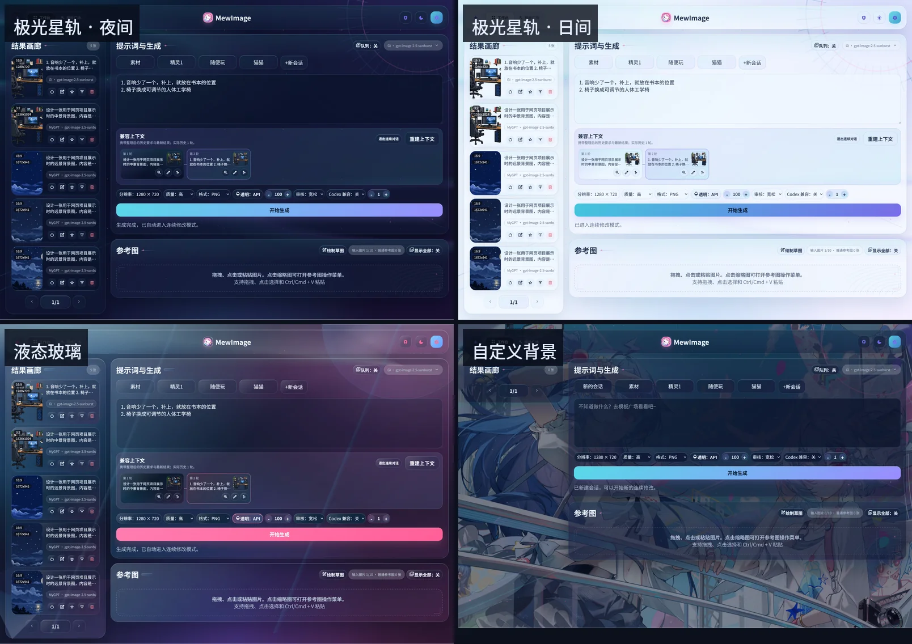

<p align="center">
  <picture>
    <source media="(prefers-color-scheme: dark)" srcset="favicon/og-image-dark.png">
    
  </picture>
</p>

<p align="center">
  <a href="documentation/"></a>
  
  <a href="LICENSE"></a>
  
  <a href="https://hub.docker.com/r/mewlab/mewimage"></a>
  <a href="https://hub.docker.com/r/mewlab/mewimage"></a>
  
  
</p>

<p align="center">Rust 写的本地优先图片生成平台，Docker 单容器部署。</p>

<p align="center">
  <a href="https://www.bilibili.com/video/BV1njKa6VEm8/">Bilibili 演示</a> ·
  <a href="https://youtu.be/43DXly6Cw5U">YouTube 演示</a> ·
  <a href="docs/quickstart.md">快速开始</a> ·
  <a href="documentation/">完整文档</a>
</p>

## 截图

*经典 Mew 主题的工作台*



*三套主题（经典 Mew / 极光星轨 / 液态玻璃）各自都有日间与夜间。这里放的是极光星轨的夜间、日间，以及液态玻璃和自定义背景*



## 功能

- **本地优先**：不登录就能用工作台，历史、会话、参考图、收藏、服务商配置和 API Key 存在浏览器的 IndexedDB 里。
- **同步是可选项**：登录并通过管理员审批后，才有跨设备同步和服务器图片存储；同步只在点「立即同步」时执行。
- **三类服务商**：`OpenAI Image`、`Nano Banana`、`OpenAI 兼容` 各用一套配置，协议不混用；请求可走 Direct、Proxy 或 Smart 链路。
- **参考图与编辑**：普通参考图最多 10 张（遮罩单独计数），带参考图时请求发到 `/v1/images/edits`；编辑器有局部修改、标记、草图三种模式。
- **连续修改**：从任意一轮结果「从此继续」或从中间分支；Responses API 用 `previous_response_id` 接上上游会话，其他协议带最近 20 轮上下文重建。
- **生图队列**：打开队列后提交即出等待卡，可以继续改参数再提交；最多 20 个活动任务，单个任务等 30 分钟。
- **透明背景**：走上游的原生透明参数；中转站不支持时在浏览器里用色键去背，输出带 Alpha 的 PNG 或 WebP。
- **模板广场**：公开模板可搜索、按多标签筛选、按最新或热门排序，点赞和收藏不需要登录。
- **托管账号**：管理员把上游连接信息留在服务端，托管用户的浏览器、同步快照和导出包里都没有地址与 Key。
- **管理后台**：`#/admin` 里分页筛选用户、批量批准或禁用、导出 CSV、查看审计日志。
- **存储**：图片放宿主机目录或 S3 兼容对象存储；单文件默认 64 MiB，每个已审批用户默认 5 GiB。

## 快速开始

服务器上装好 Docker 与 Docker Compose 即可，镜像里已经包含前端、后端和 SQLite。

```bash
mkdir -p mewimage && cd mewimage

curl -LO https://raw.githubusercontent.com/Rabbit-bot-No-002/MewImage/main/docker-compose.yml
curl -o .env https://raw.githubusercontent.com/Rabbit-bot-No-002/MewImage/main/.env.example

openssl rand -hex 32      # 填给 MEW_AUTH_SECRET
openssl rand -base64 32   # 填给 MEW_ADMIN_TOKEN
```

编辑 `.env`，至少改三项：

```dotenv
MEW_AUTH_SECRET=第一条命令的输出
MEW_ADMIN_TOKEN=第二条命令的输出
MEW_ALLOWED_ORIGINS=https://你的正式域名
```

容器以固定的非 root 用户 `10001:10001` 运行，`./data` 要自己建：

```bash
chmod 600 ./.env
sudo mkdir -p ./data/assets ./data/.tmp
sudo chown -R 10001:10001 ./data

docker compose up -d
```

打开站点注册第一个账号，在「管理员初始化」里填入 `MEW_ADMIN_TOKEN`，之后普通用户注册会进入待审批状态。

> ⚠️ 改了 `.env` 要重建容器：`docker compose up -d` 会检测变化并重建，`docker compose restart` 不会重读 `.env`。

## 文档

| 文档 | 内容 |
| --- | --- |
| [快速开始](documentation/quickstart.md) | 四条命令跑起来，创建第一个管理员 |
| [部署](documentation/deploy.md) | 端口与绑定、反向代理、HTTPS、目录权限、升级 |
| [环境变量参考](documentation/config.md) | `.env` 里每个变量的默认值与风险 |
| [工作台与生图](documentation/workbench.md) | 服务商、请求链路、生成参数、尺寸约束、队列 |
| [参考图与编辑器](documentation/editor.md) | 参考图上限、三种编辑模式、连续修改 |
| [手动云同步](documentation/sync.md) | 同步范围、合并规则、数据导出与恢复 |
| [账号与权限](documentation/accounts.md) | 注册审批、登录防护、会话与 Cookie |
| [托管账号](documentation/managed.md) · [管理后台](documentation/admin.md) | 服务端托管上游、用户管理与审计 |
| [排障](documentation/troubleshooting.md) | 权限、502、CORS、SSRF、配额等常见现象 |
| [架构与设计原则](documentation/architecture.md) · [安全边界](documentation/security.md) · [后端 API](documentation/api.md) | 给读代码的人 |

完整目录见 [`documentation/`](documentation/)。

## 技术栈

| 部分 | 实现 |
| --- | --- |
| 前端 | Leptos 0.8 CSR（WASM）+ Trunk，历史与图片存在 IndexedDB |
| 后端 | Axum + SQLx + SQLite，上传与同步走同源接口 |
| 共享层 | `shared` crate：数据结构、参数校验、同步信封 |
| 存储 | 本地目录或 S3 兼容对象存储 |
| 部署 | 单容器镜像，非 root（`10001:10001`），默认只绑定 `127.0.0.1:3188` |

## 本地开发

```bash
rustup target add wasm32-unknown-unknown
cargo install trunk --version 0.21.14 --locked

cargo run -p mew-image-backend    # 后端 127.0.0.1:3000
cd frontend && trunk serve --open  # 前端 8080
```

`cargo run` 不会自动读根目录的 `.env`（那是 `docker compose` 的行为），要读到变量得在启动后端的同一个终端里先 `export`。本机或局域网的上游会被 SSRF 策略拦住，按情况开 `MEW_ALLOW_LOOPBACK_UPSTREAM` / `MEW_DEV_BYPASS_UPSTREAM_SSRF`——两个开关都要求后端自己监听环回地址，启动日志会写明生效没有。

踩过的坑（`.env` 不自动加载、图片重定向也走检查、Fake-IP DNS、Windows 跑整个工作区测试、依赖审计例外）整理在[本地开发与联调](documentation/local-dev.md)。

## 许可

MIT，见 [LICENSE](LICENSE)；第三方组件声明见 [THIRD_PARTY_NOTICES.md](THIRD_PARTY_NOTICES.md)。
